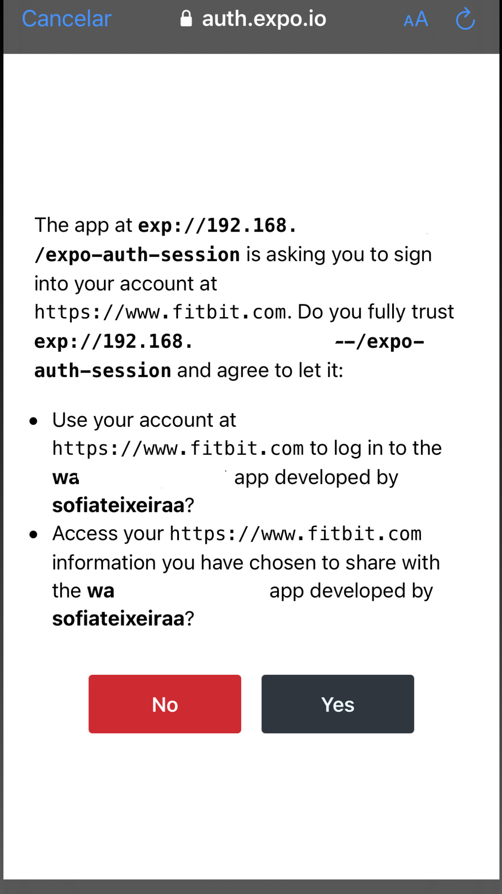
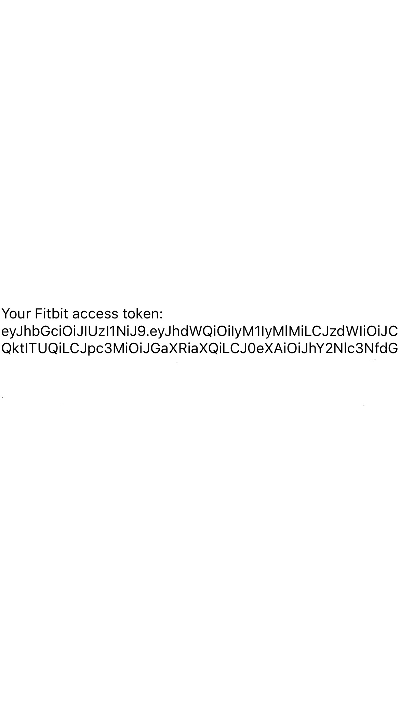

# react-native-expo-fitbit
Explanation regarding the authentication procress with React Native app (using expo) &amp; Fitbit 

To develop a mobile app using React Native and Expo that can fetch, for example, heart rate data from a Fitbit smartwatch, you'll need to integrate with the Fitbit API. 

# 1. Create a Fitbit Developer Account

Go here to Sign Up: https://www.fitbit.com/signup

# 2. Register your App
Go to https://dev.fitbit.com/ and under the menu "Manage" click on "Register an App" and fill out the form. For the OAuth 2.0 Application Type, choose "Personal". For the Callback URL, you'll need to use a URL that you can handle redirect responses on - this is often a server you control or a specific URL provided by a library if you're using one to handle OAuth 2.0.

# 3. Setup React Native App Using Expo 
Make sure you have Node.js and npm/yarn installed on your system. Install expo-cli globally using npm:

```
npm install -g expo-cli

```
```
expo init myfitbitapp
```

```
cd myfitbitapp

```

# 4. Implement Authentication

1. Install the expo-auth-session library
```
expo install expo-auth-session

```
2. Modify you App.js

```
import React, { useEffect } from 'react';
import { Button, Text, View} from 'react-native';
import * as AuthSession from 'expo-auth-session';
import qs from 'qs';


const config = {
  clientId: 'CLIENT_ID', // replace with your Fitbit app's client ID
  scopes: ['heartrate', 'activity', 'profile', 'sleep'],
};
const redirectUri = AuthSession.makeRedirectUri({ useProxy: true });
console.log(redirectUri);

const getFitbitAuthUrl = () => {
  const baseUrl = 'https://www.fitbit.com/oauth2/authorize';
  redirectUri;
  const queryParams = qs.stringify({
    client_id: config.clientId,
    response_type: 'token',
    scope: config.scopes.join(' '),
    redirect_uri: redirectUri,
    expires_in: '31536000',
  });

  return `${baseUrl}?${queryParams}`;
};

export default function App() {
  const [authToken, setAuthToken] = React.useState(null);

  const handlePress = async () => {
    const authUrl = getFitbitAuthUrl();
    const result = await AuthSession.startAsync({ authUrl });

    if (result.type === 'success') {
      setAuthToken(result.params.access_token);
    }
  };

  console.log(authToken);
  return (
    <View style={{ flex: 1, justifyContent: 'center', alignItems: 'center' }}>
      {authToken ? (
        <Text>Your Fitbit access token: {authToken}</Text>
      ) : (
        <Button title="Authorize Fitbit" onPress={handlePress} />
      )}
    </View>
    
  );

}

```

# 5. Callback URL 

The callback URL (also known as the redirect URI) is the URL where Fitbit will send the user after they've authenticated with their Fitbit account. It's where your app receives the authorization code, which it can then exchange for an access token.

IMPORTANT: Using a custom URL scheme (myfitbitapp://redirect) will not work in the Expo Go client app! So, instead, you need to use "expo-auth-session": This library provides a web-based OAuth2 authentication flow and does not require any native code, making it compatible with Expo's managed workflow. This part of the code shows how to use expo-auth-session for Fitbit OAuth2 authentication. (it is already implemented on the previous code)

```
const redirectUri = AuthSession.makeRedirectUri({ useProxy: true });
console.log(redirectUri);
```

Don't forget to paste the redirectUrl generated with this code on your Callback URL field on the app registration process - fitbit website.


# 6. Login on expo 

```
expo login
```

This command will ask you to enter your Expo username and password. If you don't have an Expo account, you can create one by clicking the "Sign Up" link.


# 7. Run the app

```
expo start
```

Scan the QR Code with your phone to open this code on Expo Go app.

It will apear this, click the button "Authorize FitBit":


Then, here, click the "yes" button:




And that't it! On your console should appear the Auth Token!




